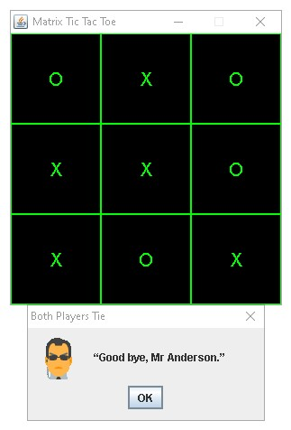

# The Matrix Tic Tac Toe

## Summary
This project is a Java GUI application, made in Eclipse, that simulates a game of tic tac toe. Neo (Player X) is the human player and Agent Smith (Player O) is the computer player. The game ends when either player has won or there is a tie. The theme of the game is the popular sci-fi action media franchise, 'The Matrix.' All product names, logos, and brands are property of their respective owners. No copyright infringement intended.

## Directions
With Java installed, simply double click '**matrix_tictactoe.jar**,' to play the game. Alternatively, you can open the project in Eclipse and run '**matrix_tictactoe.jar**' or '**matrix_tictactoe.java**,' in the src folder.

## Scenarios
1. Neo (Player X) wins. 
 

2. Agent Smith (Player O) wins. 
 

3. Both players tie. 
 
